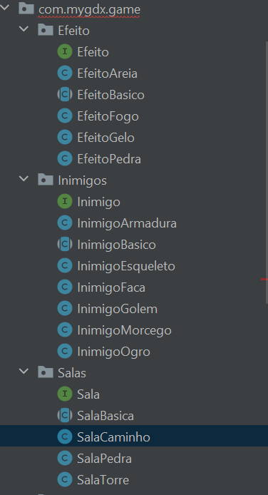
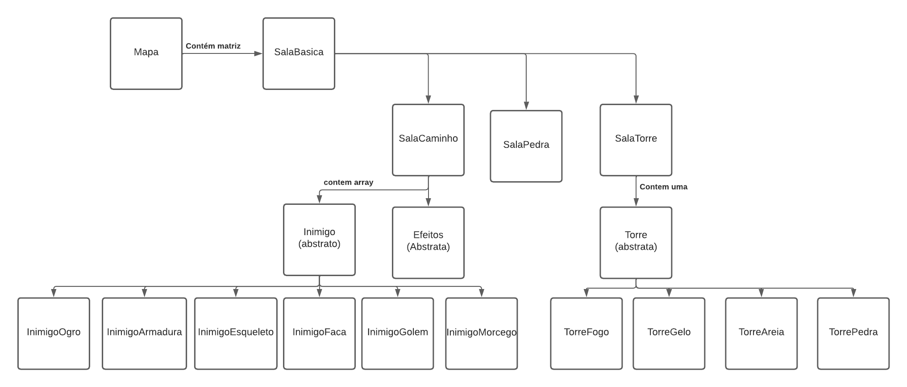
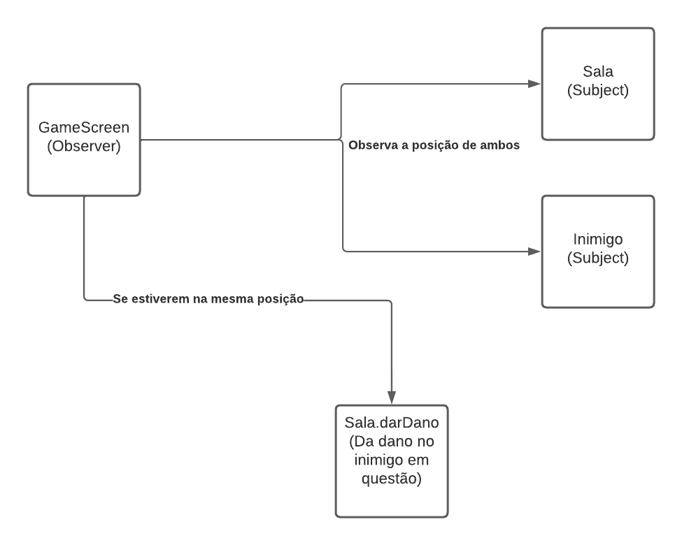
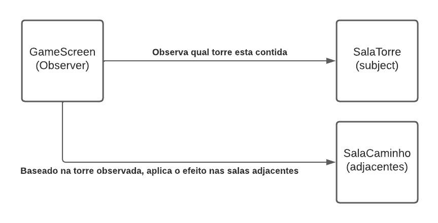
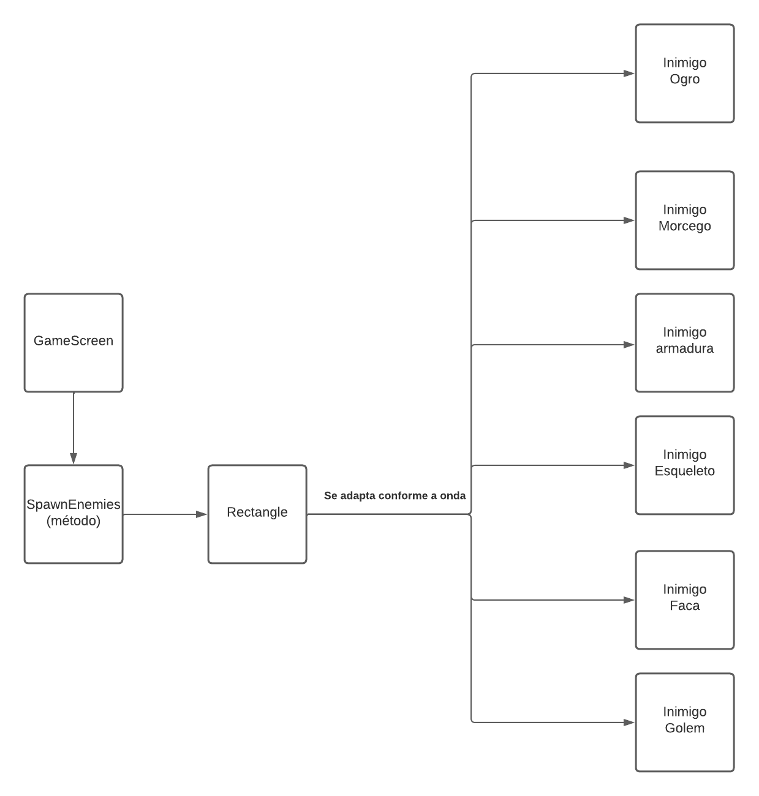
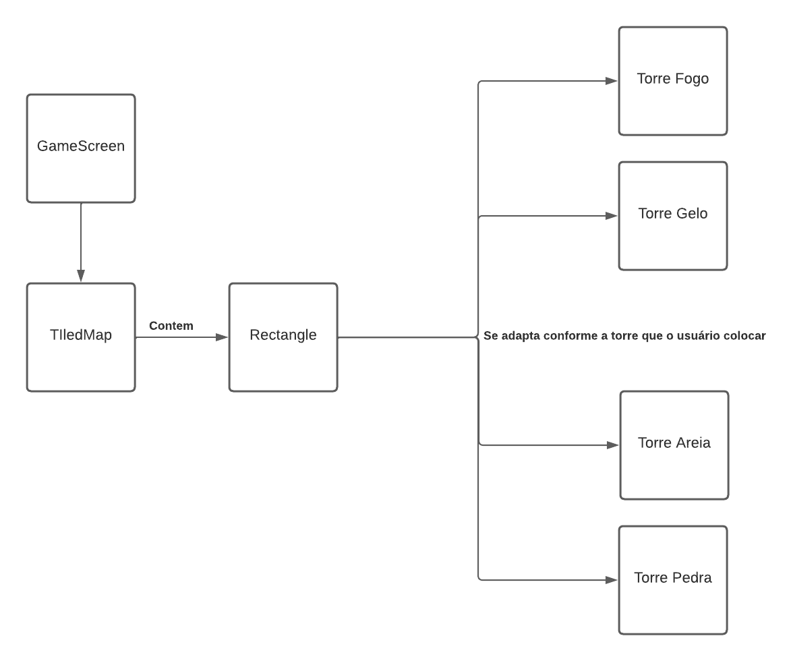

# Projeto `Tower Defense`

# Descrição Resumida do Projeto/Jogo
O jogo consiste em um arcade do tipo TowerDefense, em que o jogador deve enfrentar hordas de inimigos e impedir que cheguem em seu tesouro. Para fazer isso, ele pode
comprar torres de defesa, que nesse jogo são representados como Golems, e elas irão atacar os inimigos. Ouro é ganho a cada inimigo morto e é usado para comprar mais
torres. Assim, o jogador  deve  sobreviver 10 ondas e derrotar 2 inimigos do tipo Boss para vencer.

# Equipe
* `Gustavo Molino Teixeira Alves` - `247144`
* `Rodrigo Botelho Zuiani` - `245244`

# Arquivo Executável do Jogo

[Executável](https://github.com/Grupo-Gustavo-Rodrigo-lab05/TrabPOO/blob/main/src/TrabPOO/desktop/build/libs/desktop-1.0.jar)

# Slides do Projeto

## Slides da Prévia
[Slides Prévia](https://github.com/Grupo-Gustavo-Rodrigo-lab05/TrabPOO/blob/main/assets/ApresentaçãoPrévia.pptx)

## Slides da Apresentação Final
[Slides Final](https://github.com/Grupo-Gustavo-Rodrigo-lab05/TrabPOO/blob/main/assets/ApresentaçãoFinal.pptx)

## Relatório de Evolução

> Relatório de evolução, descrevendo as evoluções do design do projeto, dificuldades enfrentadas, mudanças de rumo, melhorias e lições aprendidas. Referências aos diagramas e recortes de mudanças são bem-vindos.

# Destaques de Código

> Escolha trechos relevantes e/ou de destaque do seu código. Apresente um recorte (você pode usar reticências para remover partes menos importantes). Veja como foi usado o highlight de Java para o código.

~~~java
// Recorte do seu código
public void algoInteressante(…) {
   …
   trechoInteressante = 100;
}
~~~

# Destaques de Orientação a Objetos
>Buscamos durante todo o código usar polimorfismo de modo que, Salas, inimigos e efeitos possuem todos um interface e uma classe abstrata, desse modo, declaramos sempre apenas a classe abstrata e instanciamos o objeto em um dos filhos de modo espeficico.
Exemplo de declaração abstrata das salas:
Imagem que mostra organização das classes com Interface-Classe abstrata(Implementa Interface)-Classes filhas( Extendem a abstrata)

## Diagrama de Classes usada no destaque OO:

## Código do Destaque OO
~~~java
public Mapa() {
        this.salas = new SalaBasica[9][5];

        //Gera uma matriz de salas que será o mapa no BackEnd
        for (int i = 0; i < 7; i++)
            for (int j = 0; j < 5; j++)
                if (i == 1 || i == 3|| i == 5) {
                    if (j == 1 || j == 3)
                        salas[i][j] = new SalaTorre(i, j, new TorreVazia(i, j));
                    else if ((j == 2 || j == 4) && (i == 1 || i == 5))
                        salas[i][j] = new SalaPedra(i, j);
                    else if ((j == 0 || j == 2) && i == 3)
                        salas[i][j] = new SalaPedra(i, j);
                    else
                        salas[i][j] = new SalaCaminho(i, j);
                }
                else
                    salas[i][j] = new SalaCaminho(i, j);
    }
~~~
Sala declarando seus efeitos e inimigos
~~~java
public class SalaCaminho extends SalaBasica {
    private Array<InimigoBasico> enemies;
    protected EfeitoBasico[] efeitos;
    public SalaCaminho(int x, int y) {
        super(x, y);
        enemies = new Array<InimigoBasico>();
        tipo = 'C';
        this.efeitos = new EfeitoBasico[2];
        for(int j = 0; j < 2; j++)
            efeitos[j] = null;
    }
~~~~

# Destaques de Pattern
> Os principais Patterns adotados pela equipe foram o Observer Pattern e o Adpater Pattern

## Diagrama do Pattern
Observer Pattern para salas e inimigos

Observer Pattern para torres

Adapter Pattern Inimigos

Adapter Pattern torres

## Código do Pattern
~~~java
// Recorte do código do pattern seguindo as mesmas diretrizes de outros destaques
public void algoInteressante(…) {
   …
   trechoInteressante = 100;
}
~~~

> Explicação de como o pattern foi adotado e quais suas vantagens, referenciando o diagrama.

# Conclusões e Trabalhos Futuros

> Apresente aqui as conclusões do projeto e propostas de trabalho futuro. Esta é a oportunidade em que você pode indicar melhorias no projeto a partir de lições aprendidas e conhecimentos adquiridos durante a realização do projeto, mas que não puderam ser implementadas por questões de tempo. Por exemplo, há design patterns aprendidos no final do curso que provavelmente não puderam ser implementados no jogo -- este é o espaço onde você pode apresentar como aplicaria o pattern no futuro para melhorar o jogo.

# Documentação dos Componentes

O vídeo a seguir apresenta um detalhamento de um projeto baseado em componentes:

# Diagramas

## Diagrama Geral da Arquitetura do Jogo

> Faça uma breve descrição do diagrama.

## Diagrama Geral de Componentes

> Se você adotou componentes de software, apresente a documentação de componentes conforme o modelo.

### Exemplo 1

Este é o diagrama compondo componentes para análise:

### Exemplo 2

Este é um diagrama inicial do projeto de jogos:

### Exemplo 3

Este é outro diagrama de um projeto de vendas:

Para cada componente será apresentado um documento conforme o modelo a seguir:

## Componente `<Nome do Componente>`

> Resumo do papel do componente e serviços que ele oferece.

**Ficha Técnica**
item | detalhamento
----- | -----
Classe | `<caminho completo da classe com pacotes>`   Exemplo: `pt.c08componentes.s20catalog.s10ds.DataSetComponent`
Autores | `<nome dos membros que criaram o componente>`
Interfaces | `<listagem das interfaces do componente>`

### Interfaces

Interfaces associadas a esse componente:

Interface agregadora do componente em Java:

~~~java
public interface IDataSet extends ITableProducer, IDataSetProperties {
}
~~~

## Detalhamento das Interfaces

### Interface `<nome da interface>`

`<Resumo do papel da interface.>`

~~~
<Interface em Java.>
~~~

Método | Objetivo
-------| --------
`<id do método em Java>` | `<objetivo do método e descrição dos parâmetros>`

## Exemplo:

### Interface `ITableProducer`

Interface provida por qualquer fonte de dados que os forneça na forma de uma tabela.

~~~java
public interface ITableProducer {
  String[] requestAttributes();
  String[][] requestInstances();
}
~~~

Método | Objetivo
-------| --------
`requestAttributes` | Retorna um vetor com o nome de todos os atributos (colunas) da tabela.
`requestInstances` | Retorna uma matriz em que cada linha representa uma instância e cada coluna o valor do respectivo atributo (a ordem dos atributos é a mesma daquela fornecida por `requestAttributes`.

### Interface `IDataSetProperties`

Define o recurso (usualmente o caminho para um arquivo em disco) que é a fonte de dados.

~~~java
public interface IDataSetProperties {
  public String getDataSource();
  public void setDataSource(String dataSource);
}
~~~

Método | Objetivo
-------| --------
`getDataSource` | Retorna o caminho da fonte de dados.
`setDataSource` | Define o caminho da fonte de dados, informado através do parâmetro `dataSource`.

# Plano de Exceções

## Diagrama da hierarquia de exceções
> Elabore um diagrama com a hierarquia de exceções como detalhado a seguir.

## Descrição das classes de exceção

> Monte uma tabela descritiva seguindo o exemplo:

Classe | Descrição
----- | -----
DivisaoInvalida | Engloba todas as exceções de divisões não aceitas.
DivisaoInutil | Indica que a divisão por 1 é inútil.
DivisaoNaoInteira | Indica uma divisão não inteira.
